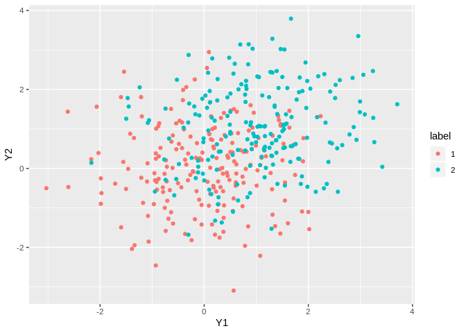
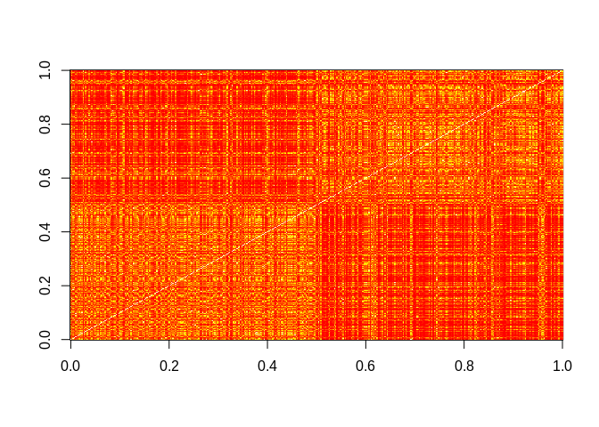
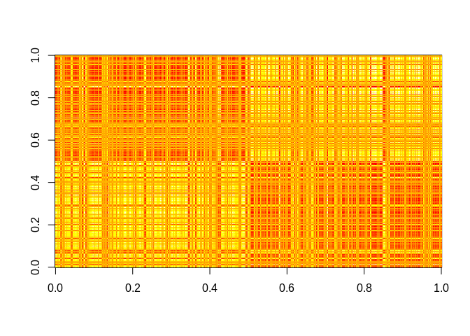
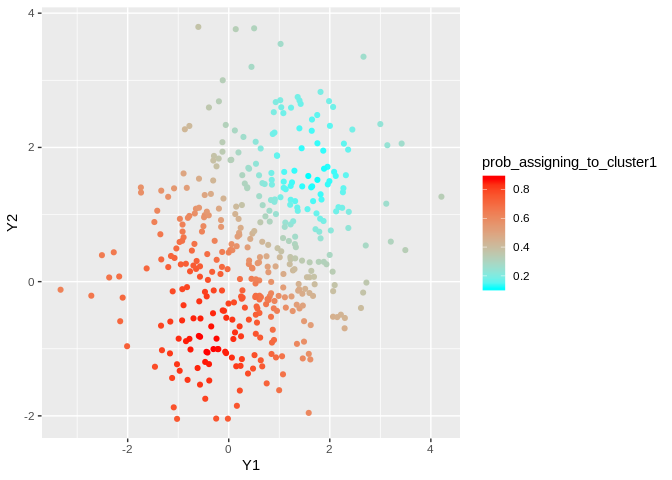

Illustration of the Simplex Clustering
================
Leo Duan

## Generate Data

Simulate two clusters of data

<!-- -->

## Compute the similarity

<!-- -->

## Fit the model

    ## 20 - 110390.3 
    ## 40 - 109304.5 
    ## 60 - 107877.7 
    ## 80 - 107013.6 
    ## 100 - 106662 
    ## 120 - 106546.9 
    ## 140 - 106510.1 
    ## 160 - 106496.8 
    ## 180 - 106491.4 
    ## 200 - 106489.1 
    ## 220 - 106487.9 
    ## 240 - 106487.4 
    ## 260 - 106487.1 
    ## 280 - 106486.9 
    ## 300 - 106486.8 
    ## 320 - 106486.8 
    ## 340 - 106486.7 
    ## 360 - 106486.7 
    ## 380 - 106486.7 
    ## 400 - 106486.7 
    ## 420 - 106486.7 
    ## 440 - 106486.7 
    ## 460 - 106486.7 
    ## 480 - 106486.7 
    ## 500 - 106486.7 
    ## 520 - 106486.7 
    ## 540 - 106486.7 
    ## 560 - 106486.7 
    ## 580 - 106486.7 
    ## 600 - 106486.7 
    ## 620 - 106486.7 
    ## 640 - 106486.7 
    ## 660 - 106486.7 
    ## 680 - 106486.7 
    ## 700 - 106486.7 
    ## 720 - 106486.7 
    ## 740 - 106486.7 
    ## 760 - 106486.7 
    ## 780 - 106486.7 
    ## 800 - 106486.7 
    ## 820 - 106486.7 
    ## 840 - 106486.7 
    ## 860 - 106486.7 
    ## 880 - 106486.7 
    ## 900 - 106486.7 
    ## 920 - 106486.7 
    ## 940 - 106486.7 
    ## 960 - 106486.7 
    ## 980 - 106486.7 
    ## 1000 - 106486.7 
    ## 1020 - 106486.7 
    ## 1040 - 106486.7 
    ## 1060 - 106486.7 
    ## 1080 - 106486.7 
    ## 1100 - 106486.7 
    ## 1120 - 106486.7 
    ## 1140 - 106486.7 
    ## 1160 - 106486.7 
    ## 1180 - 106486.7 
    ## 1200 - 106486.7 
    ## 1220 - 106486.7 
    ## 1240 - 106486.7 
    ## 1260 - 106486.7 
    ## 1280 - 106486.7 
    ## 1300 - 106486.7 
    ## 1320 - 106486.7 
    ## 1340 - 106486.7 
    ## 1360 - 106486.7 
    ## 1380 - 106486.7 
    ## 1400 - 106486.7 
    ## 1420 - 106486.7 
    ## 1440 - 106486.7 
    ## 1460 - 106486.7 
    ## 1480 - 106486.7 
    ## 1500 - 106486.7 
    ## 1520 - 106486.7 
    ## 1540 - 106486.7 
    ## 1560 - 106486.7 
    ## 1580 - 106486.7 
    ## 1600 - 106486.7 
    ## 1620 - 106486.7 
    ## 1640 - 106486.7 
    ## 1660 - 106486.7 
    ## 1680 - 106486.7 
    ## 1700 - 106486.7 
    ## 1720 - 106486.7 
    ## 1740 - 106486.7 
    ## 1760 - 106486.7 
    ## 1780 - 106486.7 
    ## 1800 - 106486.7 
    ## 1820 - 106486.7 
    ## 1840 - 106486.7 
    ## 1860 - 106486.7 
    ## 1880 - 106486.7 
    ## 1900 - 106486.7 
    ## 1920 - 106486.7 
    ## 1940 - 106486.7 
    ## 1960 - 106486.7 
    ## 1980 - 106486.7 
    ## 2000 - 106486.7

<!-- -->

<!-- -->
