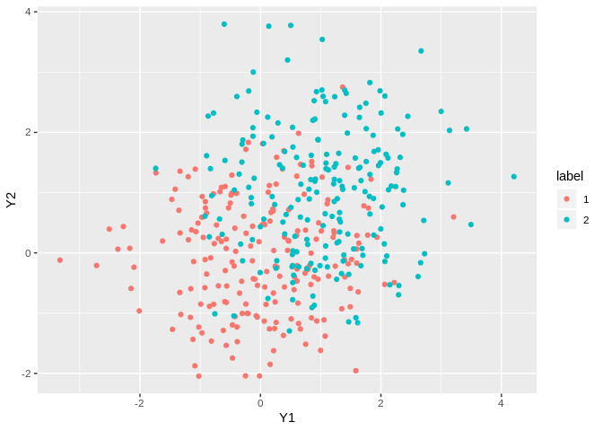
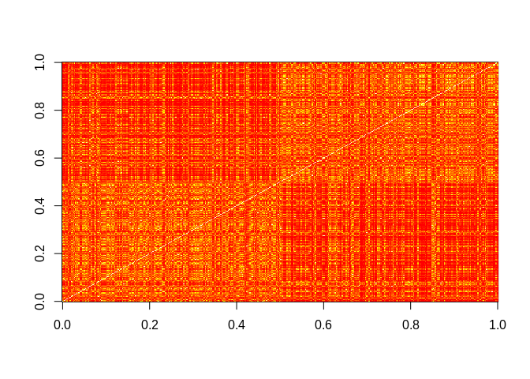

Illustration of the Latent Simplex Model for Fast Clustering with UQ
================
Leo Duan

## Generate Data

Simulate two clusters of data

``` r
library(tensorflow)
library(ggplot2)

setwd("~/git/SimplexEmbedding/")

Y = cbind( c(rnorm(200), rnorm(200)+1), c(rnorm(200), rnorm(200)+1))

ground_truth= rep(c(1:2),each=200)
df1 =  data.frame(Y1=Y[,1],Y2=Y[,2] , label= as.factor(ground_truth))

#plot the uncertainty
ggplot(df1)+ geom_point(aes(Y1,Y2,col=label))
```

<!-- -->

## Compute the similarity

``` r
D<- as.matrix(dist(Y))

#empirical selection of bandwidth based on quantile in each row
b = sqrt(apply(D,1, function(x) quantile(x,prob=0.3)))

S<- exp(-t(D/b)/b)

#first stage: similarity matrix
image(S)
```

<!-- -->

## Fit the model

``` r
source("LatentSimplex.r")

SC_fit<- SimplexClust(S,lambda = 0)
```

    ## 20 - 110246.1 
    ## 40 - 109088.2 
    ## 60 - 107853.5 
    ## 80 - 107146.6 
    ## 100 - 106843.9 
    ## 120 - 106707.3 
    ## 140 - 106641.2 
    ## 160 - 106607.7 
    ## 180 - 106589.9 
    ## 200 - 106580.2 
    ## 220 - 106575 
    ## 240 - 106572.2 
    ## 260 - 106570.7 
    ## 280 - 106569.9 
    ## 300 - 106569.5 
    ## 320 - 106569.4 
    ## 340 - 106569.3 
    ## 360 - 106569.2 
    ## 380 - 106569.2 
    ## 400 - 106569.2 
    ## 420 - 106569.2 
    ## 440 - 106569.2 
    ## 460 - 106569.2 
    ## 480 - 106569.2 
    ## 500 - 106569.2 
    ## 520 - 106569.2 
    ## 540 - 106569.2 
    ## 560 - 106569.2 
    ## 580 - 106569.2 
    ## 600 - 106569.2 
    ## 620 - 106569.2 
    ## 640 - 106569.2 
    ## 660 - 106569.2 
    ## 680 - 106569.2 
    ## 700 - 106569.2 
    ## 720 - 106569.2 
    ## 740 - 106569.2 
    ## 760 - 106569.2 
    ## 780 - 106569.2 
    ## 800 - 106569.2 
    ## 820 - 106569.2 
    ## 840 - 106569.2 
    ## 860 - 106569.2 
    ## 880 - 106569.2 
    ## 900 - 106569.2 
    ## 920 - 106569.2 
    ## 940 - 106569.2 
    ## 960 - 106569.2 
    ## 980 - 106569.2 
    ## 1000 - 106569.2 
    ## 1020 - 106569.2 
    ## 1040 - 106569.2 
    ## 1060 - 106569.2 
    ## 1080 - 106569.2 
    ## 1100 - 106569.2 
    ## 1120 - 106569.2 
    ## 1140 - 106569.2 
    ## 1160 - 106569.2 
    ## 1180 - 106569.2 
    ## 1200 - 106569.2 
    ## 1220 - 106569.2 
    ## 1240 - 106569.2 
    ## 1260 - 106569.2 
    ## 1280 - 106569.2 
    ## 1300 - 106569.2 
    ## 1320 - 106569.2 
    ## 1340 - 106569.2 
    ## 1360 - 106569.2 
    ## 1380 - 106569.2 
    ## 1400 - 106569.2 
    ## 1420 - 106569.2 
    ## 1440 - 106569.2 
    ## 1460 - 106569.2 
    ## 1480 - 106569.2 
    ## 1500 - 106569.2 
    ## 1520 - 106569.2 
    ## 1540 - 106569.2 
    ## 1560 - 106569.2 
    ## 1580 - 106569.2 
    ## 1600 - 106569.2 
    ## 1620 - 106569.2 
    ## 1640 - 106569.2 
    ## 1660 - 106569.2 
    ## 1680 - 106569.2 
    ## 1700 - 106569.2 
    ## 1720 - 106569.2 
    ## 1740 - 106569.2 
    ## 1760 - 106569.2 
    ## 1780 - 106569.2 
    ## 1800 - 106569.2 
    ## 1820 - 106569.2 
    ## 1840 - 106569.2 
    ## 1860 - 106569.2 
    ## 1880 - 106569.2 
    ## 1900 - 106569.2 
    ## 1920 - 106569.2 
    ## 1940 - 106569.2 
    ## 1960 - 106569.2 
    ## 1980 - 106569.2 
    ## 2000 - 106569.2

``` r
require(ggplot2)

df =  data.frame(Y1=Y[,1],Y2=Y[,2], prob_assigning_to_cluster1 =SC_fit$P[,1] )

#estimated co-assignment probability matrix
image(SC_fit$A)
```

<!-- -->

``` r
#plot the uncertainty
ggplot(df)+ geom_point(aes(Y1,Y2,col=prob_assigning_to_cluster1))+
  scale_colour_gradientn(colours = rev(rainbow(2)))
```

<!-- -->
